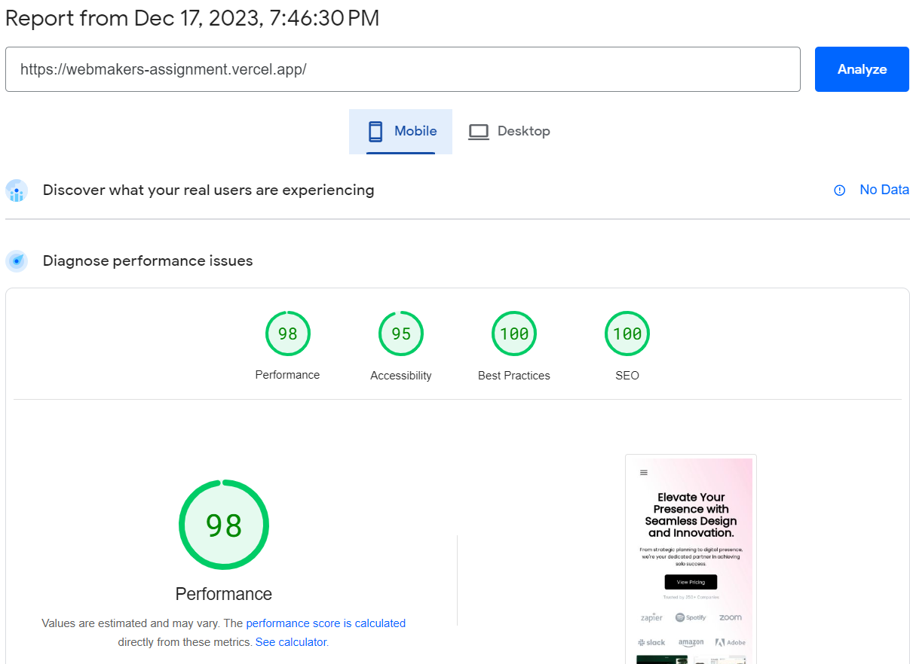
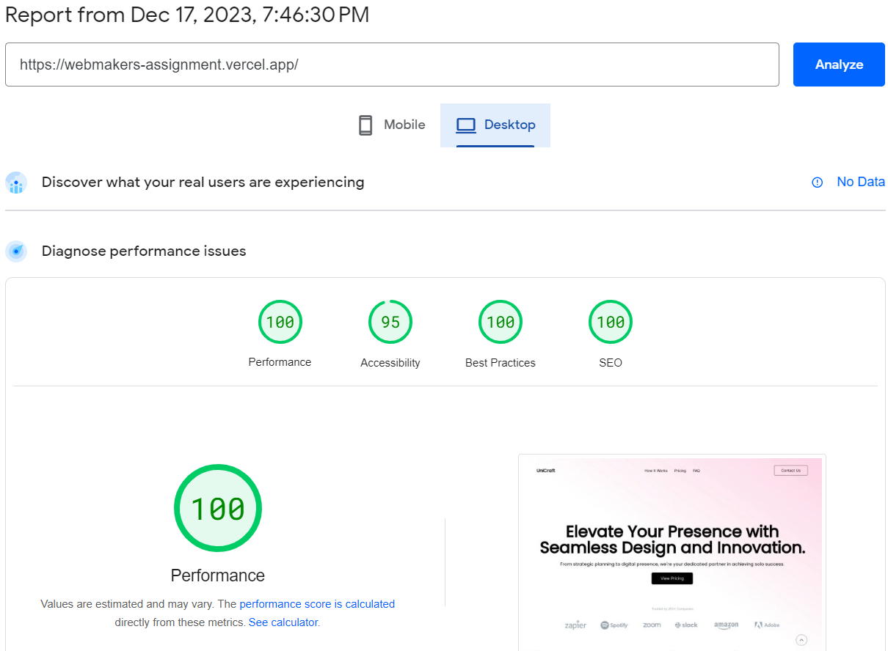

# Frontend Internship Task - UniCraft App

Hosted with Vercel at https://webmakers-assignment.vercel.app/

## To run app locally
    
  Clone the app
    
    git clone https://github.com/adelicia-js/webmakers-assignment.git

  Install dependencies

    npm i

  Run app

    npm run dev
  
  Open the app in your browser:

  [localhost:5173](http://localhost:5173/)
  
## File Structure / App Breakdown
    src -
        - components - body - Intro.jsx
                            - Carousel.jsx
                            - Working.jsx
                            - Review.jsx
                            - Pricing.jsx
                            - Faq.jsx
                     - Header.jsx
                     - Body.jsx
                     - Footer.jsx
                     - Top.jsx
        - App.css
        - App.jsx
        - index.css
        - main.jsx
        - index.html

### The codebase has been split into several components & sub-components.

- Header.jsx contains the navigation bars - a general navbar for screens >= 640px & a small navbar for screen < 640px.

- Body.jsx contains all the main content of the app, and the sub-components are in components/body.
  - Intro.jsx contains introductory headings and the list of companies that UniCraft has worked with.
  - Carousel.jsx contains a small list of images displaying recent works.
  - Working.jsx contains the process of working with UniCraft.
  - Review.jsx contains a client review.
  - Pricing.jsx contains the 3 pricing plans - Freebie, Professional and Enterprise.
  - Faq.jsx contains the frequently asked questions.

- Footer.jsx contains the contact us section which opens up a modal when clicked and users can fill a form, socials list and the footer.
  - The socials list has temporaily been populated with links related to webmakers/the founder.

- Top.jsx contains a back-to-top button, which remains fixed close to the bottom of the page, and is always visible.

- Media has been stored under public/ and as .webp files to reduce file size & improve load times.

- Fonts are locally stored under src/fonts/ as .ttf files.

## Performance Metrics (According to Lighthouse)

This is only to discuss steps I took to improve app performance as much as possible, and my success in the process.

- Mobile Performance 
  

- Desktop Performance
  

  This was achieved through multiple suggestions offered by the Lighthouse website (https://pagespeed.web.dev/) which greatly improved aspects like accessibility (which was especially initially affected), performance and a better user experience.

Some steps I took were:
- Add unique, meaningful ids to elements.
- Add aria labels to links, especially image-based links (icons, for example) to specify their purposes clearly.
- Appropriately use flow content (ul, li, div tags to be appropriately nested).
- Reduce unused JavaScript. 
- Add meaningful, descriptive metadata.
- Add alt texts to images. 